# PortfolioCrafter: Autonomous Trading Research Platform — Technical Design Document

## 🎯 Executive Summary

**PortfolioCrafter** is an AI-powered autonomous trading research platform that leverages Large Language Models (LLMs) to generate, optimize, and backtest quantitative trading strategies. The system combines modern Python data science tools with advanced AI reasoning to create a comprehensive research environment for algorithmic trading.

### Key Features
- **🤖 AI-Powered Strategy Generation**: Uses Google Gemini Pro for intelligent strategy creation
- **⚡ Vectorized Backtesting**: High-performance backtesting with vectorbt integration
- **📊 Advanced Visualization**: Interactive charts and comprehensive performance analytics
- **🔍 Market Regime Detection**: Automatic classification of market environments
- **🎛️ Parameter Optimization**: Automated hyperparameter tuning for strategies
- **🖥️ Web Interface**: User-friendly Streamlit dashboard for interaction

---

## 🏗️ System Architecture

### High-Level Architecture Diagram

```mermaid
flowchart TB
    %% Input Layer
    UI[🖥️ Streamlit Dashboard] 
    CONFIG[📋 config.yaml<br/>Stock Universe Definition]
    ENV[🔐 .env<br/>API Keys]
    
    %% Agent Orchestration Layer
    ORCHESTRATOR[🤖 Agent Orchestrator<br/>LangGraph StateGraph]
    
    %% Core Agent Components
    PLANNER[🧠 Planning Agent<br/>LangChain + Gemini Pro]
    EXECUTOR[⚡ Execution Agent<br/>Strategy Implementation]
    ANALYZER[📊 Analysis Agent<br/>Performance Evaluation]
    
    %% Data Processing Pipeline
    INGEST[📥 Data Ingestion<br/>yfinance + FRED APIs]
    FEATURES[⚙️ Feature Engineering<br/>Technical Indicators]
    REGIME[🔍 Market Regime Detection<br/>Bull/Bear/Sideways Classification]
    
    %% Strategy Development Pipeline
    REGISTRY[📚 Strategy Registry<br/>Momentum, Mean Reversion, etc.]
    GENERATOR[🎯 Strategy Generator<br/>LLM-Powered Creation]
    OPTIMIZER[🎛️ Parameter Optimizer<br/>Hyperparameter Tuning]
    
    %% Backtesting & Analysis
    BACKTEST[⚡ Vectorized Backtesting<br/>vectorbt Engine]
    METRICS[📈 Performance Metrics<br/>Risk-Adjusted Returns]
    RISK[🛡️ Risk Management<br/>Drawdown & Position Limits]
    
    %% Output Generation
    VISUALIZER[📊 Visualization Engine<br/>matplotlib + plotly]
    FORMATTER[📋 Report Generator<br/>Mathematical Formulas]
    STORAGE[💾 Results Storage<br/>Timestamped Archives]
    
    %% Data Flow Connections
    UI --> ORCHESTRATOR
    CONFIG --> ORCHESTRATOR
    ENV --> ORCHESTRATOR
    
    ORCHESTRATOR --> PLANNER
    ORCHESTRATOR --> EXECUTOR  
    ORCHESTRATOR --> ANALYZER
    
    PLANNER --> INGEST
    INGEST --> FEATURES
    FEATURES --> REGIME
    REGIME --> GENERATOR
    
    GENERATOR --> REGISTRY
    GENERATOR --> OPTIMIZER
    OPTIMIZER --> BACKTEST
    
    EXECUTOR --> BACKTEST
    BACKTEST --> METRICS
    METRICS --> RISK
    
    ANALYZER --> VISUALIZER
    ANALYZER --> FORMATTER
    VISUALIZER --> STORAGE
    FORMATTER --> STORAGE
    
    STORAGE --> UI
    
    %% Styling
    classDef agent fill:#ffd700,stroke:#333,stroke-width:3px
    classDef data fill:#e3f2fd,stroke:#1976d2,stroke-width:2px
    classDef strategy fill:#e8f5e8,stroke:#388e3c,stroke-width:2px
    classDef output fill:#fff3e0,stroke:#f57c00,stroke-width:2px
    classDef input fill:#fce4ec,stroke:#c2185b,stroke-width:2px
    
    class UI,CONFIG,ENV input
    class ORCHESTRATOR,PLANNER,EXECUTOR,ANALYZER agent
    class INGEST,FEATURES,REGIME,BACKTEST,METRICS data
    class REGISTRY,GENERATOR,OPTIMIZER,RISK strategy
    class VISUALIZER,FORMATTER,STORAGE output
```



### Component Architecture

The system follows a modular, agent-based architecture with clear separation of concerns:

1. **Input Layer**: User interface, configuration, and environment setup
2. **Agent Layer**: AI-powered reasoning and decision making
3. **Data Layer**: Market data processing and feature engineering
4. **Strategy Layer**: Strategy development and optimization
5. **Output Layer**: Visualization, reporting, and storage

---

## 🤖 Agent Reasoning Framework

### LangGraph Agent Workflow


### Agent Decision Tree

1. **Initialization Phase**
   - Parse configuration from `config.yaml`
   - Validate API keys and data sources
   - Initialize strategy registry and backtesting engine

2. **Market Analysis Phase** 
   - Fetch OHLCV data for specified universe
   - Compute technical indicators (50+ features)
   - Classify market regime (Bull/Bear/Sideways)
   - Analyze correlation structure between assets

3. **Strategy Generation Phase**
   - Query LLM for strategy ideas based on market regime
   - Generate mathematical formulations
   - Create parameter ranges for optimization
   - Validate strategy logic and constraints

4. **Optimization Phase**
   - Grid search or Bayesian optimization for parameters
   - Walk-forward analysis for robustness
   - Risk-adjusted performance evaluation
   - Multi-objective optimization (return vs risk)

5. **Execution Phase**
   - Vectorized backtesting using historical data
   - Transaction cost modeling
   - Position sizing and risk management
   - Performance attribution analysis

6. **Reporting Phase**
   - Generate interactive visualizations
   - Create mathematical strategy documentation
   - Export results in multiple formats
   - Archive with timestamps for tracking

---

## 📊 Data Architecture

### Data Sources & Integration


### Data Processing Pipeline

1. **Ingestion Layer**
   - **yfinance API**: Real-time market data for stocks, ETFs, indices
   - **FRED API**: Macroeconomic indicators (interest rates, inflation, etc.)
   - **Data Validation**: Completeness checks, outlier detection
   - **Storage Format**: Parquet files for efficient compression and querying

2. **Feature Engineering Layer**
   - **Technical Indicators**: RSI, MACD, Bollinger Bands, Moving Averages
   - **Volatility Metrics**: Realized volatility, GARCH models
   - **Momentum Factors**: Price momentum, earnings momentum
   - **Cross-Asset Features**: Correlations, spreads, ratios

3. **Regime Detection Layer**
   - **Volatility Regime**: VIX-based classification
   - **Trend Regime**: Moving average relationships
   - **Correlation Regime**: Cross-asset correlation analysis
   - **Macro Regime**: Economic indicators integration

---

## 🎯 Strategy Development Framework

### Strategy Registry Architecture


### Available Strategy Types

1. **Momentum Strategies**
   - Moving average crossovers
   - Price momentum signals
   - Trend following algorithms

2. **Mean Reversion Strategies**
   - Bollinger Bands
   - RSI-based signals
   - Statistical arbitrage

3. **Volatility Strategies**
   - Volatility targeting
   - VIX-based signals
   - Risk parity approaches

4. **Regime-Based Strategies**
   - Market regime adaptive allocation
   - Dynamic strategy switching
   - Conditional strategy execution

---

## ⚡ Backtesting Engine

### Vectorized Backtesting with vectorbt

```python
# Example backtesting workflow
import vectorbt as vbt

# Load data and signals
data = vbt.YFData.download(["SPY", "QQQ"], period="2y")
signals = generate_strategy_signals(data.get("Close"))

# Execute portfolio simulation
portfolio = vbt.Portfolio.from_signals(
    data.get("Close"),
    entries=signals["entries"],
    exits=signals["exits"],
    init_cash=100000,
    fees=0.001
)

# Calculate performance metrics
stats = portfolio.stats()
```

### Performance Metrics Calculation

The system calculates comprehensive performance metrics:

- **Return Metrics**: Total return, annual return, excess return
- **Risk Metrics**: Volatility, Sharpe ratio, Sortino ratio, maximum drawdown
- **Risk-Adjusted Metrics**: Information ratio, Calmar ratio, Sterling ratio
- **Trade Analysis**: Win rate, average trade, profit factor
- **Portfolio Metrics**: Beta, alpha, correlation, tracking error

---

## 📈 Visualization & Reporting

### Interactive Dashboard Components

1. **Portfolio Performance Charts**
   - Equity curve visualization
   - Drawdown analysis
   - Rolling performance metrics

2. **Strategy Composition**
   - Asset allocation pie charts
   - Weight evolution over time
   - Rebalancing frequency analysis

3. **Risk Analytics**
   - VaR and CVaR analysis
   - Risk-return scatter plots
   - Correlation heatmaps

### Report Generation Pipeline

```python
# Example report generation
def generate_strategy_report(strategy_results):
    """
    Generate comprehensive strategy report with:
    - Mathematical formulation
    - Performance summary
    - Risk analysis
    - Visual charts
    """
    report = {
        'strategy_formula': get_strategy_formula(strategy_results),
        'performance_metrics': calculate_metrics(strategy_results),
        'risk_analysis': analyze_risk(strategy_results),
        'charts': create_visualizations(strategy_results)
    }
    return report
```

---

## 🔧 Configuration Management

### config.yaml Structure

```yaml
# Project Configuration
project_name: "PortfolioCrafter"
log_level: "INFO"

# Universe Definition
universe:
  - "SPY"   # S&P 500 ETF
  - "QQQ"   # NASDAQ 100 ETF
  - "IWM"   # Russell 2000 ETF
  - "TLT"   # 20+ Year Treasury ETF
  - "GLD"   # Gold ETF

# Data Configuration
data:
  yfinance_period: "5y"
  update_frequency: "daily"
  cache_enabled: true
  
# Agent Configuration  
agent:
  model: "gemini-pro"
  temperature: 0.1
  max_strategies: 10
  optimization_method: "bayesian"
  
# Backtesting Parameters
backtest:
  initial_cash: 100000
  commission: 0.001  # 0.1%
  slippage: 0.0005   # 0.05%
  start_date: "2020-01-01"
  
# Risk Management
risk:
  max_position_size: 0.5
  max_drawdown: 0.2
  stop_loss: 0.05
  
# Output Configuration
output:
  save_results: true
  figure_format: "png"
  report_format: "html"
```

### Environment Variables (.env)

```bash
# Required: Google Gemini API Key for AI strategy generation
GOOGLE_API_KEY=your_gemini_api_key_here

# Optional: FRED API Key for macroeconomic data
FRED_API_KEY=your_fred_api_key_here

# Optional: Logging configuration
LOG_LEVEL=INFO
```

---

## 🚀 Deployment Architecture

### Local Development Setup

```bash
# Environment Setup
python -m venv venv
source venv/bin/activate  # Windows: venv\Scripts\activate
pip install -r requirements.txt

# Configuration
cp .env.example .env
# Edit .env with your API keys

# Run Application
streamlit run src/app/streamlit_app.py
```

### Production Deployment Options

1. **Docker Containerization**
   ```dockerfile
   FROM python:3.11-slim
   WORKDIR /app
   COPY requirements.txt .
   RUN pip install -r requirements.txt
   COPY . .
   EXPOSE 8501
   CMD ["streamlit", "run", "src/app/streamlit_app.py"]
   ```

2. **Cloud Deployment**
   - **Streamlit Cloud**: Direct GitHub integration
   - **Heroku**: Container-based deployment
   - **AWS/GCP/Azure**: VM or container services

---

## 📂 Repository Structure

```
PortfolioCrafter/
├── 📋 config.yaml              # Configuration file
├── 📊 requirements.txt         # Python dependencies
├── 🔐 .env.example            # Environment template
├── 📚 README.md               # Project documentation
├── 🏗️ DESIGN.md              # Technical design (this file)
├── 📁 src/                    # Source code
│   ├── 🤖 agent/             # AI Agent Components
│   │   ├── simple_planner.py      # Basic strategy planner
│   │   └── langchain_planner.py   # Advanced LLM integration
│   ├── 💾 data/              # Data Pipeline
│   │   ├── ingest.py             # Market data fetching
│   │   └── schemas.py            # Data structures
│   ├── ⚙️ features/          # Feature Engineering
│   │   ├── engine.py             # Technical indicators
│   │   └── regime.py             # Market regime detection
│   ├── 📈 strategies/        # Strategy Library
│   │   ├── momentum.py           # Momentum strategies
│   │   ├── multi_strategy.py     # Advanced strategies
│   │   └── strategy_registry.py  # Strategy catalog
│   ├── ⚡ backtest/          # Backtesting Engine
│   │   ├── runner.py             # Backtest execution
│   │   ├── metrics.py            # Performance analytics
│   │   └── simple_backtest.py    # Basic backtesting
│   ├── 📊 visualization/     # Charts & Reports
│   │   └── plots.py              # Interactive visualizations
│   ├── 🖥️ app/              # User Interface
│   │   └── streamlit_app.py      # Web dashboard
│   └── 🔧 utils/             # Utilities
│       ├── config.py             # Configuration management
│       ├── logging.py            # System logging
│       └── backtest_utils.py     # Backtesting utilities
├── 💾 data_store/            # Market data cache
├── 📊 figures/               # Generated charts
├── 📁 docs/                  # Documentation
└── 🧪 tests/                # Test suite
```

---

## 🔄 Data Flow Architecture

### End-to-End Process Flow

1. **User Input** → Streamlit UI collects user preferences
2. **Configuration** → System loads config.yaml and .env settings
3. **Data Ingestion** → Fetch market data via yfinance/FRED APIs
4. **Feature Engineering** → Compute technical indicators and features
5. **Regime Detection** → Classify current market environment
6. **Strategy Generation** → AI agent creates strategy proposals
7. **Parameter Optimization** → Fine-tune strategy parameters
8. **Backtesting** → Execute vectorized performance simulation
9. **Risk Analysis** → Calculate comprehensive metrics
10. **Visualization** → Generate interactive charts and reports
11. **Storage** → Archive results with timestamps

### API Integration Points

- **yfinance**: Primary market data source
- **FRED**: Macroeconomic indicators
- **Google Gemini**: LLM-powered strategy generation
- **vectorbt**: High-performance backtesting
- **matplotlib/plotly**: Visualization rendering

---

## 🛡️ Risk Management Framework

### Risk Controls

1. **Position Sizing Limits**
   - Maximum position size per asset
   - Portfolio concentration limits
   - Leverage constraints

2. **Drawdown Controls**
   - Maximum drawdown thresholds
   - Stop-loss mechanisms
   - Dynamic position sizing

3. **Correlation Management**
   - Cross-asset correlation monitoring
   - Diversification requirements
   - Sector exposure limits

### Performance Attribution

The system provides detailed performance attribution analysis:

- **Asset Contribution**: Individual asset performance impact
- **Strategy Attribution**: Strategy-specific return sources
- **Risk Factor Analysis**: Exposure to market factors
- **Transaction Cost Analysis**: Impact of fees and slippage

---

## 🎓 Mathematical Foundations

### Strategy Formulation

Each strategy is mathematically formulated with clear entry and exit rules:

```
Example: Momentum Crossover Strategy

Entry Signal: MA_fast(t) > MA_slow(t) AND MA_fast(t-1) <= MA_slow(t-1)
Exit Signal: MA_fast(t) < MA_slow(t) AND MA_fast(t-1) >= MA_slow(t-1)

Where:
- MA_fast(t) = Simple Moving Average over N_fast periods
- MA_slow(t) = Simple Moving Average over N_slow periods
- t = current time period
```

### Performance Metrics

Key mathematical formulations used in the system:

**Sharpe Ratio**: `(Portfolio Return - Risk-Free Rate) / Portfolio Volatility`

**Maximum Drawdown**: `min(Portfolio Value / Peak Portfolio Value - 1)`

**Sortino Ratio**: `(Portfolio Return - Risk-Free Rate) / Downside Deviation`

---

## 🚧 Future Enhancements

### Planned Features

1. **Advanced AI Integration**
   - GPT-4 integration for enhanced reasoning
   - Multi-agent orchestration with specialized roles
   - Reinforcement learning for strategy optimization

2. **Extended Asset Coverage**
   - Cryptocurrency markets
   - International equities
   - Options and derivatives

3. **Real-Time Execution**
   - Live trading integration
   - Order management system
   - Risk monitoring dashboard

4. **Advanced Analytics**
   - Factor model analysis
   - Alternative data integration
   - Regime prediction models

### Technical Debt & Improvements

- Code optimization for larger universes
- Enhanced error handling and logging
- Comprehensive test suite expansion
- Performance profiling and optimization

---

## 📞 Support & Contributing

### Getting Help

- **Documentation**: Comprehensive guides in `/docs`
- **Examples**: Sample configurations and strategies
- **Issues**: GitHub issue tracker for bug reports

### Contributing Guidelines

1. Fork the repository
2. Create feature branch
3. Add comprehensive tests
4. Update documentation
5. Submit pull request

---

*This document serves as the comprehensive technical design reference for PortfolioCrafter. For implementation details, see the source code and accompanying documentation.*
