# PortfolioCrafter: AI-Powered Autonomous Trading Research Platform

[](https://github.com/OnePunchMonk/PortfolioCrafter)

## 🚀 Revolutionizing Quantitative Finance with Agentic AI

*Transform stock selection into complete trading strategies in < 5 minutes through autonomous AI agents*

---

## 🎯 Problem Statement

Traditional quantitative trading requires:
- **Extensive Domain Expertise**: Years of experience in strategy development
- **Manual Research Process**: Time-intensive coding and testing cycles  
- **Limited Strategy Exploration**: Human bias restricts discovery space
- **Fragmented Workflows**: Separate tools for data, backtesting, and analysis
- **Static Approaches**: Inability to adapt to changing market conditions

**The Gap**: No unified platform that can autonomously transform a simple stock universe into complete, mathematically-formulated, backtested trading strategies.

## 💡 Our Solution: Complete Agentic Automation

**PortfolioCrafter** is the first truly autonomous quantitative trading research platform that:

✅ **Abstracts All Quant Work**: Input stock symbols → Output complete strategies  
✅ **Mathematical Formulation**: Auto-generates strategy equations and logic  
✅ **Real-World Data**: Backtests using live market data via yfinance API  
✅ **Visual Results**: Professional-grade plots and performance analytics  
✅ **Zero Manual Coding**: No programming knowledge required  

### The Magic: From Stocks to Strategies in Minutes

```
INPUT:  ["AAPL", "MSFT", "GOOGL"]  →  AGENT PROCESSING  →  OUTPUT: Complete Trading System
```

1. **You provide**: Stock universe in `config.yaml`
2. **Agent handles**: Data fetching, feature engineering, regime detection, strategy formulation, backtesting, visualization
3. **You receive**: Ready-to-use strategies with mathematical formulas and performance metrics

## 🏗️ Architecture: Agentic AI at the Core

```mermaid
flowchart TB
    UI[🖥️ Streamlit Interface] --> AGENT[🤖 LangChain Agent Brain]
    CONFIG[📋 config.yaml<br/>Stock Universe] --> AGENT
    
    AGENT --> DL[📊 Data Layer<br/>yfinance + FRED]
    AGENT --> FE[⚙️ Feature Engine<br/>Technical Indicators]
    AGENT --> RD[🔍 Regime Detection<br/>Market Analysis]
    AGENT --> SG[🧠 Strategy Generation<br/>LLM-Powered]
    
    SG --> BT[⚡ Backtest Engine<br/>vectorbt]
    BT --> VIZ[📈 Visualization<br/>Interactive Charts]
    VIZ --> RESULTS[📋 Strategy Reports<br/>Mathematical Formulas]
    
    subgraph "🤖 Autonomous Agent Layer"
        AGENT
        SG
    end
    
    subgraph "🔄 Processing Pipeline"
        DL
        FE
        RD
        BT
    end
    
    subgraph "📊 Output Layer"
        VIZ
        RESULTS
    end
    
    classDef agent fill:#ffd700,stroke:#333,stroke-width:3px
    classDef process fill:#e1f5fe,stroke:#333,stroke-width:2px
    classDef output fill:#c8e6c9,stroke:#333,stroke-width:2px
    classDef input fill:#fff3e0,stroke:#333,stroke-width:2px
    
    class UI,CONFIG input
    class AGENT,SG agent
    class DL,FE,RD,BT process
    class VIZ,RESULTS output
```



## 🛠️ Technology Stack

### Core AI & Agent Framework
- **🧠 LangChain + LangGraph**: Structured agent workflows and reasoning
- **🤖 Google Gemini Pro**: Large Language Model for strategy planning
- **🔄 Autonomous Agents**: Self-directed planning, execution, and analysis

### Financial Computing Engine  
- **🐍 Python 3.10+**: High-performance numerical computing
- **📊 vectorbt**: Lightning-fast vectorized backtesting
- **📈 yfinance**: Real-time market data integration
- **🏦 FRED API**: Macroeconomic indicators
- **📋 pandas + numpy**: Data manipulation and analysis

### Visualization & Interface
- **🖥️ Streamlit**: Interactive web-based dashboard
- **📊 matplotlib + plotly**: Professional trading charts
- **💾 Parquet**: Efficient data storage format

## 📁 Repository Structure

```
PortfolioCrafter/
├── 📋 config.yaml              # Stock universe configuration
├── 🚀 run_app.py              # Application entry point
├── 📊 requirements.txt         # Python dependencies
├── 📁 src/
│   ├── 🤖 agent/              # AI Agent Brain
│   │   ├── langchain_planner.py    # LLM-powered strategy generation
│   │   ├── policy.py               # Trading policies
│   │   └── runner.py               # Agent execution engine
│   ├── 💾 data/               # Data Pipeline
│   │   ├── ingest.py              # Market data fetching
│   │   └── schemas.py             # Data structures
│   ├── ⚙️ features/           # Feature Engineering
│   │   ├── engine.py              # Technical indicators
│   │   └── regime.py              # Market regime detection
│   ├── 📈 strategies/         # Strategy Library
│   │   ├── momentum.py            # Momentum strategies
│   │   ├── multi_strategy.py      # Advanced strategies
│   │   └── strategy_registry.py   # Strategy catalog
│   ├── ⚡ backtest/          # Backtesting Engine
│   │   ├── runner.py              # Backtest execution
│   │   ├── metrics.py             # Performance analytics
│   │   └── simple_backtest.py     # Basic backtesting
│   ├── 📊 visualization/     # Charts & Reports
│   │   └── plots.py               # Interactive visualizations
│   ├── 🖥️ app/               # User Interface
│   │   └── streamlit_app.py       # Web dashboard
│   └── 🔧 utils/             # Utilities
│       ├── config.py              # Configuration management
│       └── logging.py             # System logging
├── 💾 data_store/            # Market data cache
├── 📊 figures/               # Generated charts
└── 🧪 tests/                # Test suite
```

## 🚀 Quick Start Guide

### Step 1: Setup Environment

```bash
# Clone the repository
git clone https://github.com/eshubhat/Stock-Market-Prediction-and-Trading-Agent.git
cd <folderName>

# Install dependencies
pip install -r requirements.txt
```

### Step 2: Configure Your Stock Universe

Edit `config.yaml` to specify your target stocks:

```yaml
universe:
  - "AAPL"    # Apple
  - "MSFT"    # Microsoft  
  - "GOOGL"   # Google
  - "TSLA"    # Tesla
  - "NVDA"    # NVIDIA
```

### Step 3: Set Up API Keys

Create a `.env` file:

```bash
# Required for AI agent
GOOGLE_API_KEY=your_gemini_api_key_here

# Optional for macro data
FRED_API_KEY=your_fred_api_key_here
```

### Step 4: Launch the Platform

```bash
# Start the Streamlit dashboard
python run_app.py
```

🎉 **That's it!** Navigate to `http://localhost:8501` and let the AI agents work their magic!

## 🎮 How to Use: From Stocks to Strategies

### 1. **Select Your Universe** (30 seconds)
- Choose stocks from the sidebar
- Set date ranges for analysis  
- Configure number of strategies to generate

### 2. **Agent Takes Over** (2-5 minutes)
- **Data Fetching**: Automatically downloads market data
- **Feature Engineering**: Computes 50+ technical indicators
- **Regime Detection**: Identifies current market conditions
- **Strategy Generation**: Creates 5-10 unique strategies using AI
- **Backtesting**: Tests each strategy on historical data
- **Optimization**: Fine-tunes parameters automatically

### 3. **Review Results** (Instant)
- **Performance Charts**: Interactive equity curves
- **Mathematical Formulas**: Exact strategy equations
- **Risk Metrics**: Sharpe ratio, max drawdown, volatility
- **Portfolio Allocation**: Dynamic asset weighting
- **Comparison Analysis**: Strategy vs benchmark performance

## 📸 Platform Screenshots

### Main Dashboard - Strategy Generation Interface

*The main Streamlit interface where users configure stock universe and generate AI-powered trading strategies*

### Strategy Performance Analysis

*Comprehensive performance metrics and equity curve visualization for generated strategies*

### Portfolio Composition & Allocation

*Dynamic asset allocation charts showing portfolio weights and rebalancing over time*

### Risk Analytics Dashboard

*Detailed risk analysis including drawdown analysis, Sharpe ratios, and volatility metrics*

## 🧠 AI Agent Capabilities: The Complete Quant Researcher

### Does PortfolioCrafter Abstract All Quantitative Work? **YES!** ✅

**Traditional Quant Workflow** (Weeks/Months):
```
1. Data Collection       → 📊 Hours of setup
2. Feature Engineering   → 🔧 Days of coding  
3. Strategy Development  → 🧠 Weeks of research
4. Backtesting          → ⚡ Days of debugging
5. Optimization         → 🎯 Weeks of tuning
6. Visualization        → 📈 Hours of plotting
7. Documentation        → 📋 Hours of writing
```

**PortfolioCrafter Workflow** (Minutes):
```
1. Input Stock Universe  → ⏱️ 30 seconds
2. Click "Generate"      → 🖱️ 1 click
3. Get Complete Results  → 🎉 2-5 minutes
```

### What the Agent Autonomously Handles:

✅ **Data Pipeline**: Fetches real-time data from yfinance API  
✅ **Feature Engineering**: 50+ technical indicators automatically computed  
✅ **Market Regime Analysis**: Detects bull/bear/sideways markets  
✅ **Strategy Formulation**: Creates mathematical trading rules  
✅ **Parameter Optimization**: Finds optimal strategy parameters  
✅ **Risk Management**: Applies position sizing and drawdown limits  
✅ **Backtesting**: Full historical simulation with realistic costs  
✅ **Performance Analytics**: Comprehensive risk/return metrics  
✅ **Visualization**: Professional-grade charts and reports  
✅ **Mathematical Documentation**: Exact formulas for each strategy  

### Ready for Production Use? **Almost!** ⚠️

**What Works Today:**
- ✅ Complete strategy research automation
- ✅ Real market data integration  
- ✅ Professional backtesting results
- ✅ Mathematical strategy formulation
- ✅ Risk-adjusted performance metrics
- ✅ Publication-ready visualizations

**Remaining Friction for Live Trading:**
- ⚠️ **Broker Integration**: Need APIs for live order execution
- ⚠️ **Real-time Data**: Currently uses daily data, needs intraday feeds
- ⚠️ **Risk Controls**: Production-grade position limits and stops
- ⚠️ **Regulatory Compliance**: Trade reporting and audit trails
- ⚠️ **Latency Optimization**: Sub-second execution for high-frequency strategies

## 💡 Suggested Future Features

### 🎯 Immediate Enhancements (Next 3 months)
1. **Multi-Asset Classes**: Bonds, commodities, crypto, forex
2. **Intraday Strategies**: Minute/hourly frequency trading
3. **Options Strategies**: Covered calls, protective puts, spreads
4. **Sentiment Integration**: News, social media, earnings calls
5. **ESG Scoring**: Environmental and social impact metrics

### 🚀 Advanced Capabilities (6-12 months)  
6. **Reinforcement Learning**: Self-improving agents through market feedback
7. **Portfolio Optimization**: Modern portfolio theory with constraints
8. **Multi-Strategy Ensembles**: Combine strategies with dynamic allocation
9. **Alternative Data**: Satellite imagery, credit card transactions, weather
10. **Real-time Alerts**: Strategy performance monitoring and notifications

### 🌟 Production Features (12+ months)
11. **Broker Integration**: Interactive Brokers, Alpaca, TD Ameritrade APIs
12. **Paper Trading**: Risk-free live strategy testing
13. **Institutional Features**: Prime brokerage, custody, compliance
14. **Multi-Language Support**: R, Julia, C++ strategy implementation
15. **Cloud Deployment**: Scalable infrastructure on AWS/GCP/Azure

## 📊 Example Output: From Code to Strategy

### Input (config.yaml):
```yaml
universe: ["AAPL", "MSFT", "GOOGL"]
```

### Agent-Generated Strategy Example:

**Strategy Type**: Momentum Cross-Over  
**Mathematical Formula**:
```
Signal(t) = SMA(Close, 21) - SMA(Close, 63)
Position(t) = +1 if Signal(t) > 0, -1 if Signal(t) < 0
Allocation = {AAPL: 40%, MSFT: 35%, GOOGL: 25%}
```

**Performance Metrics**:
- Total Return: 127.3%
- Sharpe Ratio: 1.84  
- Max Drawdown: -12.7%
- Win Rate: 64.2%

**Visual Output**: Interactive charts showing equity curves, drawdown periods, and rolling metrics.

## 🎯 Target Users

### 1. **Individual Investors** 
- Replace expensive fund managers with AI-powered strategies
- No coding knowledge required
- Professional-grade results

### 2. **Quantitative Researchers**
- Accelerate strategy development by 10x
- Focus on high-level ideas vs implementation
- Rapid prototyping and testing

### 3. **Portfolio Managers**  
- Generate alpha through systematic approaches
- Reduce human bias in strategy selection
- Scale research capabilities

### 4. **Financial Educators**
- Teach quantitative concepts interactively
- Demonstrate strategy performance in real-time
- Hands-on learning without programming barriers

## 📚 Documentation

### Comprehensive Documentation Suite
- **[README.md](README.md)** - Main project overview and quickstart guide
- **[DESIGN.md](DESIGN.md)** - Complete technical architecture and system design
- **[AGENT.md](docs/AGENT.md)** - Deep dive into AI agent architecture from GenAI engineering perspective
- **[INSTALLATION.md](docs/INSTALLATION.md)** - Detailed installation and setup instructions

### Developer Resources
- **Agent Architecture**: Detailed LangGraph workflows, state management, and tool integration patterns
- **Strategy Framework**: Complete strategy development lifecycle and implementation details  
- **API Documentation**: Function signatures, parameters, and usage examples
- **Performance Tuning**: Optimization guidelines and best practices

For developers interested in the internal agent reasoning loops, multi-agent orchestration, and GenAI engineering patterns, see **[docs/AGENT.md](docs/AGENT.md)** for comprehensive technical details.

## 🤝 Contributing

We welcome contributions from the quantitative finance and AI communities:

```bash
# Fork the repository
git fork https://github.com/onepunchmonk/PortfolioCrafter.git

# Create a feature branch  
git checkout -b feature/amazing-new-feature

# Make your changes and commit
git commit -m "Add amazing new feature"

# Push to your fork and submit a pull request
git push origin feature/amazing-new-feature
```

### Areas for Contribution:
- 🧠 **AI Agents**: Enhanced reasoning and planning capabilities
- 📊 **Strategies**: New trading algorithms and risk models  
- 🔌 **Integrations**: Additional data sources and broker APIs
- 🎨 **Visualization**: Advanced charting and analytics
- 🧪 **Testing**: Comprehensive test coverage and validation

## 📄 License

This project is licensed under the MIT License - see the [LICENSE](LICENSE) file for details.

---

## 🌟 The Future of Quantitative Trading is Agentic

**PortfolioCrafter** represents a paradigm shift from manual quant development to autonomous AI-driven research. By abstracting away the complexities of strategy development, we're democratizing access to institutional-grade quantitative trading capabilities.

**Ready to transform your investment approach?** Start with a simple stock list and let our AI agents do the rest.

*PortfolioCrafter: Where AI meets quantitative trading for unprecedented strategy discovery* 🚀
