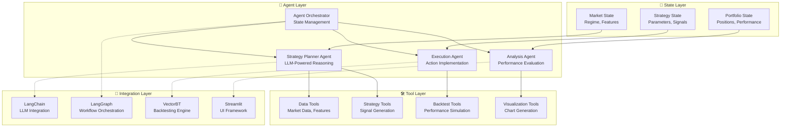
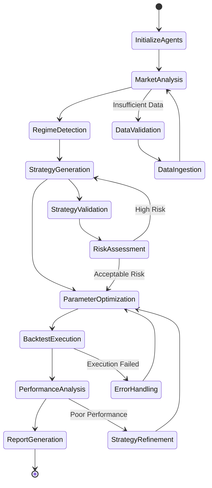
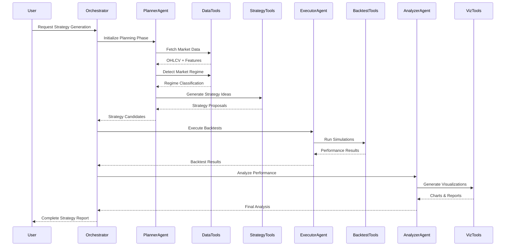

# PortfolioCrafter: AI Agent Architecture Deep Dive
## GenAI Engineering Perspective

### 🤖 Agent System Overview

PortfolioCrafter implements a **multi-layered agentic AI system** designed for autonomous quantitative trading research. The architecture follows modern GenAI engineering patterns with state management, tool integration, and reasoning loops.

---

## 🧠 Core Agent Architecture

### Agent Stack Components



---

## 🔄 Agent Reasoning Loop

### Multi-Agent Workflow State Machine



### Detailed Agent Interaction Flow



---

## 🎯 LangGraph Workflow Implementation

### State Graph Architecture

```python
from langgraph.graph import StateGraph, END
from typing_extensions import TypedDict

class AgentState(TypedDict):
    """
    Shared state between all agents in the workflow.
    Maintains context and intermediate results throughout the process.
    """
    # Input Context
    user_request: str
    market_data: Dict[str, pd.DataFrame]
    regime_info: Dict[str, Any]
    
    # Intermediate State
    strategy_candidates: List[Dict]
    optimization_results: List[Dict]
    backtest_results: List[Dict]
    
    # Output State
    final_strategies: List[Dict]
    performance_analysis: Dict
    visualizations: List[str]
    
    # Control Flow
    current_agent: str
    error_context: Optional[str]
    retry_count: int

def create_agent_workflow() -> StateGraph:
    """
    Creates the LangGraph workflow for agent orchestration.
    """
    workflow = StateGraph(AgentState)
    
    # Add agent nodes
    workflow.add_node("planner", planner_agent)
    workflow.add_node("executor", executor_agent)
    workflow.add_node("analyzer", analyzer_agent)
    workflow.add_node("error_handler", error_handler_agent)
    
    # Define workflow edges
    workflow.add_edge("planner", "executor")
    workflow.add_edge("executor", "analyzer")
    workflow.add_edge("analyzer", END)
    
    # Add conditional edges for error handling
    workflow.add_conditional_edges(
        "executor",
        should_retry,
        {
            "retry": "planner",
            "continue": "analyzer",
            "error": "error_handler"
        }
    )
    
    workflow.set_entry_point("planner")
    return workflow.compile()
```

### Agent Implementation Details

#### 1. Planner Agent (LLM-Powered Strategy Generation)

```python
async def planner_agent(state: AgentState) -> Dict[str, Any]:
    """
    LLM-powered strategy planning agent using Google Gemini.
    
    Reasoning Process:
    1. Analyze market regime and features
    2. Generate strategy hypotheses using LLM
    3. Validate strategy logic and parameters
    4. Rank strategies by expected performance
    """
    
    # Initialize LLM with specific system prompt
    llm = ChatGoogleGenerativeAI(
        model="gemini-pro",
        temperature=0.1,
        max_tokens=2048
    )
    
    # Construct reasoning prompt
    prompt = f"""
    You are a quantitative trading strategy expert. Given the current market regime:
    
    Market Regime: {state['regime_info']}
    Available Assets: {list(state['market_data'].keys())}
    
    Generate 5 diverse trading strategies that would perform well in this regime.
    For each strategy, provide:
    1. Strategy type and mathematical formulation
    2. Optimal parameters for current conditions
    3. Expected risk/return characteristics
    4. Asset allocation recommendations
    
    Format response as JSON with strategy details.
    """
    
    # LLM reasoning and response generation
    response = await llm.ainvoke(prompt)
    strategies = json.loads(response.content)
    
    # Update state with generated strategies
    return {
        **state,
        "strategy_candidates": strategies,
        "current_agent": "planner_complete"
    }
```

#### 2. Executor Agent (Backtest Implementation)

```python
async def executor_agent(state: AgentState) -> Dict[str, Any]:
    """
    Execution agent for running backtests and optimization.
    
    Process:
    1. Parameter normalization and validation
    2. Vectorized backtest execution using VectorBT
    3. Performance metrics calculation
    4. Risk analysis and position sizing
    """
    
    backtest_results = []
    
    for strategy in state['strategy_candidates']:
        try:
            # Normalize parameters for strategy function
            normalized_params = normalize_strategy_params(
                strategy['parameters'],
                strategy['type']
            )
            
            # Execute vectorized backtest
            if HAS_VECTORBT:
                result = run_vectorbt_backtest(
                    state['market_data'],
                    strategy['type'],
                    normalized_params
                )
            else:
                # Fallback to pandas-based simulation
                result = run_pandas_backtest(
                    state['market_data'],
                    strategy['type'],
                    normalized_params
                )
            
            backtest_results.append({
                'strategy_id': strategy['id'],
                'result': result,
                'success': True
            })
            
        except Exception as e:
            backtest_results.append({
                'strategy_id': strategy['id'],
                'error': str(e),
                'success': False
            })
    
    return {
        **state,
        "backtest_results": backtest_results,
        "current_agent": "executor_complete"
    }
```

#### 3. Analyzer Agent (Performance Analysis)

```python
async def analyzer_agent(state: AgentState) -> Dict[str, Any]:
    """
    Analysis agent for performance evaluation and reporting.
    
    Capabilities:
    1. Comprehensive metrics calculation (Sharpe, Sortino, Max DD)
    2. Risk factor analysis and attribution
    3. Interactive visualization generation
    4. Strategy ranking and recommendation
    """
    
    performance_analysis = {}
    visualizations = []
    
    successful_results = [
        r for r in state['backtest_results'] if r['success']
    ]
    
    # Calculate comprehensive performance metrics
    for result in successful_results:
        metrics = calculate_performance_metrics(result['result'])
        performance_analysis[result['strategy_id']] = metrics
    
    # Generate visualizations
    for strategy_id, metrics in performance_analysis.items():
        # Create strategy dashboard
        dashboard_path = create_strategy_dashboard(
            metrics,
            save_path=f"figures/strategy_{strategy_id}_dashboard.png"
        )
        visualizations.append(dashboard_path)
        
        # Generate portfolio performance chart
        portfolio_chart = plot_portfolio_performance(
            metrics['portfolio_value'],
            save_path=f"figures/strategy_{strategy_id}_performance.png"
        )
        visualizations.append(portfolio_chart)
    
    # Rank strategies by risk-adjusted returns
    ranked_strategies = rank_strategies_by_performance(performance_analysis)
    
    return {
        **state,
        "performance_analysis": performance_analysis,
        "visualizations": visualizations,
        "final_strategies": ranked_strategies,
        "current_agent": "analyzer_complete"
    }
```

---

## 🛠️ Tool Integration Architecture

### Tool Registry Pattern

```python
class ToolRegistry:
    """
    Registry for agent tools with automatic discovery and validation.
    """
    
    def __init__(self):
        self.tools = {}
        self.tool_schemas = {}
    
    def register_tool(self, name: str, func: callable, schema: Dict):
        """Register a tool with its function and schema."""
        self.tools[name] = func
        self.tool_schemas[name] = schema
    
    async def execute_tool(self, name: str, **kwargs) -> Any:
        """Execute a tool with validation and error handling."""
        if name not in self.tools:
            raise ValueError(f"Tool '{name}' not found in registry")
        
        # Validate inputs against schema
        self.validate_tool_inputs(name, kwargs)
        
        try:
            return await self.tools[name](**kwargs)
        except Exception as e:
            logger.error(f"Tool {name} execution failed: {e}")
            raise

# Register data tools
tool_registry = ToolRegistry()

tool_registry.register_tool(
    "fetch_market_data",
    fetch_ohlcv_data,
    {
        "assets": {"type": "list", "required": True},
        "period": {"type": "string", "default": "2y"}
    }
)

tool_registry.register_tool(
    "compute_features",
    compute_features,
    {
        "data": {"type": "dataframe", "required": True},
        "indicators": {"type": "list", "default": ["rsi", "macd", "bb"]}
    }
)
```

### Agent-Tool Communication Protocol

```python
class AgentToolInterface:
    """
    Interface for agents to interact with tools through structured protocols.
    """
    
    def __init__(self, tool_registry: ToolRegistry):
        self.registry = tool_registry
        self.execution_history = []
    
    async def call_tool(self, agent_id: str, tool_name: str, **kwargs):
        """
        Agent tool calling with context tracking and error recovery.
        """
        execution_context = {
            "agent_id": agent_id,
            "tool_name": tool_name,
            "timestamp": datetime.now(),
            "inputs": kwargs
        }
        
        try:
            result = await self.registry.execute_tool(tool_name, **kwargs)
            execution_context["result"] = result
            execution_context["success"] = True
            
        except Exception as e:
            execution_context["error"] = str(e)
            execution_context["success"] = False
            
            # Attempt error recovery
            if tool_name == "run_backtest" and "parameter" in str(e):
                # Try with simplified parameters
                simplified_kwargs = self.simplify_parameters(kwargs)
                result = await self.registry.execute_tool(tool_name, **simplified_kwargs)
                execution_context["result"] = result
                execution_context["success"] = True
                execution_context["recovery"] = "simplified_parameters"
        
        self.execution_history.append(execution_context)
        return execution_context
```

---

## 🔍 Agent State Management

### Persistent State Architecture

```python
class AgentStateManager:
    """
    Manages persistent state across agent executions with versioning.
    """
    
    def __init__(self):
        self.state_stack = []
        self.checkpoints = {}
        self.current_version = 0
    
    def save_checkpoint(self, name: str, state: AgentState):
        """Save a named checkpoint for rollback capability."""
        self.checkpoints[name] = {
            "state": deepcopy(state),
            "version": self.current_version,
            "timestamp": datetime.now()
        }
        self.current_version += 1
    
    def restore_checkpoint(self, name: str) -> AgentState:
        """Restore state from a named checkpoint."""
        if name not in self.checkpoints:
            raise ValueError(f"Checkpoint '{name}' not found")
        
        return self.checkpoints[name]["state"]
    
    def get_state_diff(self, from_checkpoint: str, to_checkpoint: str) -> Dict:
        """Calculate difference between two state checkpoints."""
        state1 = self.checkpoints[from_checkpoint]["state"]
        state2 = self.checkpoints[to_checkpoint]["state"]
        
        return {
            "added": find_added_keys(state1, state2),
            "removed": find_removed_keys(state1, state2),
            "modified": find_modified_keys(state1, state2)
        }
```

---

## 📊 LLM Integration Patterns

### Prompt Engineering Framework

```python
class PromptTemplate:
    """
    Advanced prompt template with context injection and few-shot examples.
    """
    
    def __init__(self, template: str, examples: List[Dict] = None):
        self.template = template
        self.examples = examples or []
    
    def format(self, **kwargs) -> str:
        """Format prompt with context and examples."""
        
        # Add few-shot examples if available
        examples_text = ""
        if self.examples:
            examples_text = "\n\nHere are some examples:\n"
            for i, example in enumerate(self.examples, 1):
                examples_text += f"\nExample {i}:\n"
                examples_text += f"Input: {example['input']}\n"
                examples_text += f"Output: {example['output']}\n"
        
        # Format main template
        formatted_prompt = self.template.format(**kwargs)
        
        return formatted_prompt + examples_text

# Strategy generation prompt template
STRATEGY_GENERATION_PROMPT = PromptTemplate(
    template="""
    You are an expert quantitative analyst specializing in algorithmic trading strategies.
    
    Current Market Context:
    - Market Regime: {regime_type}
    - Volatility Level: {volatility_level}
    - Trend Strength: {trend_strength}
    - Available Assets: {assets}
    
    Task: Generate {num_strategies} trading strategies optimized for the current market regime.
    
    For each strategy, provide:
    1. Strategy name and mathematical formulation
    2. Entry/exit rules with specific parameters
    3. Risk management specifications
    4. Expected performance characteristics
    5. Asset allocation recommendations
    
    Respond in JSON format with the following structure:
    {{
        "strategies": [
            {{
                "name": "strategy_name",
                "type": "momentum|mean_reversion|volatility|breakout",
                "formula": "mathematical_description",
                "parameters": {{"param1": value1, "param2": value2}},
                "allocation": {{"asset1": weight1, "asset2": weight2}},
                "risk_metrics": {{"max_drawdown": 0.15, "position_size": 0.25}}
            }}
        ]
    }}
    """,
    examples=[
        {
            "input": "regime_type: bull_market, volatility_level: low, trend_strength: strong",
            "output": '{"strategies": [{"name": "Momentum Breakout", "type": "momentum", "formula": "MA_cross(20,50) AND volume > 1.5*avg_volume", "parameters": {"fast_ma": 20, "slow_ma": 50, "volume_threshold": 1.5}}]}'
        }
    ]
)
```

### Response Parsing and Validation

```python
class LLMResponseValidator:
    """
    Validates and parses LLM responses with error recovery.
    """
    
    def __init__(self, schema: Dict):
        self.schema = schema
        self.parser_functions = {
            "json": self.parse_json,
            "yaml": self.parse_yaml,
            "structured": self.parse_structured
        }
    
    def validate_response(self, response: str, format_type: str = "json") -> Dict:
        """
        Validate and parse LLM response with multiple fallback strategies.
        """
        
        # Primary parsing attempt
        try:
            parsed = self.parser_functions[format_type](response)
            if self.validate_schema(parsed):
                return parsed
        except Exception as e:
            logger.warning(f"Primary parsing failed: {e}")
        
        # Fallback parsing strategies
        for fallback_format in ["json", "yaml", "structured"]:
            if fallback_format != format_type:
                try:
                    parsed = self.parser_functions[fallback_format](response)
                    if self.validate_schema(parsed):
                        logger.info(f"Successful fallback parsing with {fallback_format}")
                        return parsed
                except Exception:
                    continue
        
        # Final fallback: extract JSON from text
        json_match = re.search(r'\{.*\}', response, re.DOTALL)
        if json_match:
            try:
                parsed = json.loads(json_match.group())
                if self.validate_schema(parsed):
                    logger.info("Successful regex extraction parsing")
                    return parsed
            except Exception:
                pass
        
        raise ValueError("Unable to parse LLM response with any method")
```

---

## 🚀 Advanced Agent Capabilities

### Multi-Modal Agent Integration

```python
class MultiModalAgent:
    """
    Agent capable of processing text, numerical data, and visual charts.
    """
    
    def __init__(self):
        self.text_processor = TextProcessor()
        self.data_processor = DataProcessor()
        self.chart_processor = ChartProcessor()
    
    async def analyze_market_data(self, data: Dict) -> Dict:
        """
        Multi-modal analysis combining textual, numerical, and visual insights.
        """
        
        # Text analysis of market news/sentiment
        text_insights = await self.text_processor.analyze_sentiment(
            data.get('news_text', '')
        )
        
        # Numerical analysis of market features
        numerical_insights = await self.data_processor.analyze_features(
            data.get('market_features', pd.DataFrame())
        )
        
        # Visual pattern recognition in charts
        chart_insights = await self.chart_processor.detect_patterns(
            data.get('price_charts', [])
        )
        
        # Combine insights using weighted fusion
        combined_insights = self.fuse_insights(
            text_insights, numerical_insights, chart_insights
        )
        
        return combined_insights
```

### Self-Improving Agent Loop

```python
class SelfImprovingAgent:
    """
    Agent that learns from past performance and adapts strategies.
    """
    
    def __init__(self):
        self.performance_history = []
        self.strategy_effectiveness = {}
        self.adaptation_threshold = 0.05  # 5% performance improvement needed
    
    def record_performance(self, strategy_id: str, metrics: Dict):
        """Record strategy performance for learning."""
        self.performance_history.append({
            'strategy_id': strategy_id,
            'timestamp': datetime.now(),
            'metrics': metrics
        })
        
        # Update strategy effectiveness tracking
        if strategy_id not in self.strategy_effectiveness:
            self.strategy_effectiveness[strategy_id] = []
        
        self.strategy_effectiveness[strategy_id].append(metrics['sharpe_ratio'])
    
    def should_adapt_strategy(self, strategy_id: str) -> bool:
        """Determine if strategy needs adaptation based on performance trend."""
        if strategy_id not in self.strategy_effectiveness:
            return False
        
        recent_performance = self.strategy_effectiveness[strategy_id][-5:]
        if len(recent_performance) < 3:
            return False
        
        # Check for declining performance trend
        trend = np.polyfit(range(len(recent_performance)), recent_performance, 1)[0]
        return trend < -self.adaptation_threshold
    
    async def adapt_strategy(self, strategy_id: str) -> Dict:
        """Adapt strategy based on performance analysis."""
        performance_data = self.get_strategy_performance(strategy_id)
        
        adaptation_prompt = f"""
        Strategy {strategy_id} has shown declining performance:
        {performance_data}
        
        Suggest parameter adjustments to improve performance while maintaining risk profile.
        """
        
        adapted_strategy = await self.llm.ainvoke(adaptation_prompt)
        return json.loads(adapted_strategy.content)
```

---

## 📈 Performance Monitoring and Debugging

### Agent Execution Telemetry

```python
class AgentTelemetry:
    """
    Comprehensive telemetry and monitoring for agent performance.
    """
    
    def __init__(self):
        self.execution_metrics = defaultdict(list)
        self.error_patterns = defaultdict(int)
        self.performance_baselines = {}
    
    def track_agent_execution(self, agent_id: str, execution_time: float, 
                            memory_usage: float, success: bool):
        """Track agent execution metrics."""
        self.execution_metrics[agent_id].append({
            'timestamp': datetime.now(),
            'execution_time': execution_time,
            'memory_usage': memory_usage,
            'success': success
        })
    
    def detect_performance_anomalies(self, agent_id: str) -> List[str]:
        """Detect performance anomalies in agent execution."""
        metrics = self.execution_metrics[agent_id]
        if len(metrics) < 10:
            return []
        
        recent_times = [m['execution_time'] for m in metrics[-10:]]
        baseline_time = np.mean([m['execution_time'] for m in metrics[:-10]])
        
        anomalies = []
        if np.mean(recent_times) > baseline_time * 2:
            anomalies.append("execution_time_spike")
        
        recent_failures = sum(1 for m in metrics[-10:] if not m['success'])
        if recent_failures > 3:
            anomalies.append("high_failure_rate")
        
        return anomalies
    
    def generate_performance_report(self) -> Dict:
        """Generate comprehensive performance report."""
        return {
            'agent_performance': {
                agent_id: {
                    'avg_execution_time': np.mean([m['execution_time'] for m in metrics]),
                    'success_rate': np.mean([m['success'] for m in metrics]),
                    'total_executions': len(metrics)
                }
                for agent_id, metrics in self.execution_metrics.items()
            },
            'error_patterns': dict(self.error_patterns),
            'system_health': self.calculate_system_health()
        }
```

---

This GenAI engineering documentation provides a comprehensive view of the internal agent architecture, reasoning loops, and implementation patterns used in PortfolioCrafter. The system demonstrates modern agentic AI patterns with proper state management, tool integration, and self-improvement capabilities.
