# AgentQuant: Autonomous Trading Research Platform — Technical Design Document

## 📋 Executive Summary

**AgentQuant** is an AI-powered autonomous trading research platform that transforms stock universe selection into complete, mathematically-formulated, backtested trading strategies. The system abstracts away all quantitative research complexity, allowing users to input stock symbols and receive production-ready trading strategies.

## 🎯 Design Goals

### Primary Objectives
1. **Complete Automation**: Abstract all quantitative research work from data ingestion to strategy delivery
2. **Real-World Integration**: Use live market data and realistic trading assumptions
3. **Mathematical Rigor**: Generate precise strategy formulations with exact parameters
4. **Professional Output**: Produce institutional-grade backtesting results and visualizations
5. **Zero-Code Interface**: Enable strategy development without programming knowledge

### Operational Requirements
- **Autonomous Operation**: Minimal human intervention required
- **Safety-First Design**: Operate in "suggest-only" mode with comprehensive risk controls
- **Scalable Architecture**: Handle multiple assets and strategies simultaneously
- **Real-Time Capability**: Process market data and generate strategies efficiently

## 🏗️ System Architecture

### High-Level Architecture Diagram

```mermaid
flowchart TB
    %% Input Layer
    UI[🖥️ Streamlit Dashboard] 
    CONFIG[📋 config.yaml<br/>Stock Universe Definition]
    ENV[🔐 .env<br/>API Keys]
    
    %% Agent Orchestration Layer
    ORCHESTRATOR[🤖 Agent Orchestrator<br/>LangGraph StateGraph]
    
    %% Core Agent Components
    PLANNER[🧠 Planning Agent<br/>LangChain + Gemini Pro]
    EXECUTOR[⚡ Execution Agent<br/>Strategy Implementation]
    ANALYZER[📊 Analysis Agent<br/>Performance Evaluation]
    
    %% Data Processing Pipeline
    INGEST[📥 Data Ingestion<br/>yfinance + FRED APIs]
    FEATURES[⚙️ Feature Engineering<br/>Technical Indicators]
    REGIME[🔍 Market Regime Detection<br/>Bull/Bear/Sideways Classification]
    
    %% Strategy Development Pipeline
    REGISTRY[📚 Strategy Registry<br/>Momentum, Mean Reversion, etc.]
    GENERATOR[🎯 Strategy Generator<br/>LLM-Powered Creation]
    OPTIMIZER[🎛️ Parameter Optimizer<br/>Hyperparameter Tuning]
    
    %% Backtesting & Analysis
    BACKTEST[⚡ Vectorized Backtesting<br/>vectorbt Engine]
    METRICS[📈 Performance Metrics<br/>Risk-Adjusted Returns]
    RISK[🛡️ Risk Management<br/>Drawdown & Position Limits]
    
    %% Output Generation
    VISUALIZER[📊 Visualization Engine<br/>matplotlib + plotly]
    FORMATTER[📋 Report Generator<br/>Mathematical Formulas]
    STORAGE[💾 Results Storage<br/>Timestamped Archives]
    
    %% Data Flow Connections
    UI --> ORCHESTRATOR
    CONFIG --> ORCHESTRATOR
    ENV --> ORCHESTRATOR
    
    ORCHESTRATOR --> PLANNER
    ORCHESTRATOR --> EXECUTOR  
    ORCHESTRATOR --> ANALYZER
    
    PLANNER --> INGEST
    INGEST --> FEATURES
    FEATURES --> REGIME
    REGIME --> GENERATOR
    
    GENERATOR --> REGISTRY
    GENERATOR --> OPTIMIZER
    OPTIMIZER --> BACKTEST
    
    EXECUTOR --> BACKTEST
    BACKTEST --> METRICS
    METRICS --> RISK
    
    ANALYZER --> VISUALIZER
    ANALYZER --> FORMATTER
    VISUALIZER --> STORAGE
    FORMATTER --> STORAGE
    
    STORAGE --> UI
    
    %% Styling
    classDef agent fill:#ffd700,stroke:#333,stroke-width:3px
    classDef data fill:#e3f2fd,stroke:#1976d2,stroke-width:2px
    classDef strategy fill:#e8f5e8,stroke:#388e3c,stroke-width:2px
    classDef output fill:#fff3e0,stroke:#f57c00,stroke-width:2px
    classDef input fill:#fce4ec,stroke:#c2185b,stroke-width:2px
    
    class UI,CONFIG,ENV input
    class ORCHESTRATOR,PLANNER,EXECUTOR,ANALYZER agent
    class INGEST,FEATURES,REGIME,BACKTEST,METRICS data
    class REGISTRY,GENERATOR,OPTIMIZER,RISK strategy
    class VISUALIZER,FORMATTER,STORAGE output
```



### Component Interaction Flow


## 🤖 Agent Reasoning Framework

### LangGraph Agent Workflow


### Agent Decision Tree

1. **Initialization Phase**
   - Parse configuration from `config.yaml`
   - Validate API keys and data sources
   - Initialize strategy registry and backtesting engine

2. **Market Analysis Phase** 
   - Fetch OHLCV data for specified universe
   - Compute technical indicators (50+ features)
   - Classify market regime (Bull/Bear/Sideways)
   - Analyze correlation structure between assets

3. **Strategy Generation Phase**
   - Query LLM for strategy ideas based on market regime
   - Generate mathematical formulations
   - Create parameter ranges for optimization
   - Validate strategy logic and constraints

4. **Optimization Phase**
   - Grid search or Bayesian optimization for parameters
   - Walk-forward analysis for robustness
   - Risk-adjusted performance evaluation
   - Multi-objective optimization (return vs risk)

5. **Execution Phase**
   - Vectorized backtesting using historical data
   - Transaction cost modeling
   - Position sizing and risk management
   - Performance attribution analysis

6. **Reporting Phase**
   - Generate interactive visualizations
   - Create mathematical strategy documentation
   - Export results in multiple formats
   - Archive with timestamps for tracking

## 📊 Data Architecture

### Data Sources & Integration


### Data Processing Pipeline

1. **Ingestion Layer**
   - **yfinance API**: Real-time market data for stocks, ETFs, indices
   - **FRED API**: Macroeconomic indicators (interest rates, inflation, etc.)
   - **Data Validation**: Completeness checks, outlier detection
   - **Storage Format**: Parquet files for efficient compression and querying

2. **Feature Engineering Layer**
   - **Technical Indicators**: RSI, MACD, Bollinger Bands, Moving Averages
   - **Volatility Metrics**: Realized volatility, GARCH models
   - **Momentum Factors**: Price momentum, earnings momentum
   - **Cross-Asset Features**: Correlations, spreads, ratios

3. **Regime Detection Layer**
   - **Volatility Regime**: VIX-based classification
   - **Trend Regime**: Moving average relationships
   - **Correlation Regime**: Cross-asset correlation analysis
   - **Macro Regime**: Economic indicators integration

## 🎯 Strategy Development Framework

### Strategy Types & Mathematical Formulations

#### 1. Momentum Strategies
```python
# Simple Moving Average Crossover
Signal(t) = SMA(Close, fast_period) - SMA(Close, slow_period)
Position(t) = sign(Signal(t))

# Parameters: fast_period ∈ [5, 50], slow_period ∈ [20, 200]
```

#### 2. Mean Reversion Strategies  
```python
# Bollinger Band Reversion
Upper_Band(t) = SMA(Close, period) + k * σ(Close, period)
Lower_Band(t) = SMA(Close, period) - k * σ(Close, period)
Position(t) = -1 if Close(t) > Upper_Band(t) else +1 if Close(t) < Lower_Band(t) else 0

# Parameters: period ∈ [10, 50], k ∈ [1.5, 3.0]
```

#### 3. Volatility Strategies
```python
# Volatility Targeting
Target_Vol = 0.15  # 15% annualized
Realized_Vol(t) = σ(Returns, window) * √252
Position_Size(t) = Target_Vol / Realized_Vol(t)

# Parameters: window ∈ [20, 100], target_vol ∈ [0.10, 0.25]
```

#### 4. Multi-Asset Allocation
```python
# Risk Parity Allocation
Weight_i(t) = (1/σ_i(t)) / Σ(1/σ_j(t))
Position_i(t) = Weight_i(t) * Signal_i(t)

# Dynamic rebalancing based on changing volatilities
```

### Strategy Registry Architecture


## ⚡ Backtesting Engine

### Vectorized Backtesting with vectorbt

```python
class BacktestEngine:
    def __init__(self, initial_cash, commission, slippage):
        self.initial_cash = initial_cash
        self.commission = commission
        self.slippage = slippage
    
    def run_backtest(self, prices, signals, allocation_weights=None):
        """
        Vectorized backtesting using vectorbt for maximum performance
        """
        portfolio = vbt.Portfolio.from_signals(
            close=prices,
            entries=signals > 0,
            exits=signals < 0,
            init_cash=self.initial_cash,
            fees=self.commission,
            slippage=self.slippage
        )
        
        return {
            'equity_curve': portfolio.value(),
            'total_return': portfolio.total_return(),
            'sharpe_ratio': portfolio.sharpe_ratio(),
            'max_drawdown': portfolio.max_drawdown(),
            'calmar_ratio': portfolio.calmar_ratio(),
            'trades': portfolio.trades.records
        }
```

### Performance Metrics Calculation

1. **Return Metrics**
   - Total Return: (Final Value / Initial Value) - 1
   - Annualized Return: (1 + Total Return)^(252/Days) - 1
   - CAGR: Compound Annual Growth Rate

2. **Risk Metrics**
   - Volatility: Standard deviation of daily returns * √252
   - Sharpe Ratio: (Return - Risk-free Rate) / Volatility
   - Maximum Drawdown: Maximum peak-to-trough decline
   - Calmar Ratio: Annualized Return / Maximum Drawdown

3. **Trade Analysis**
   - Win Rate: Percentage of profitable trades
   - Profit Factor: Gross Profit / Gross Loss
   - Average Trade Return: Mean return per trade
   - Trade Frequency: Number of trades per year

## 🛡️ Risk Management Framework

### Multi-Layer Risk Controls


### Risk Parameters

1. **Position-Level Limits**
   - Maximum position size: 50% of portfolio
   - Maximum leverage: 1.0 (no margin)
   - Stop-loss levels: 5% individual position loss

2. **Portfolio-Level Limits**
   - Maximum drawdown: 20% of peak value
   - Maximum sector concentration: 30%
   - Minimum cash reserve: 5%

3. **Strategy-Level Limits**
   - Maximum correlation between strategies: 0.7
   - Minimum Sharpe ratio: 0.5
   - Maximum consecutive losing days: 10

## 📈 Visualization & Reporting

### Interactive Dashboard Components

1. **Performance Charts**
   - Equity curve with benchmark comparison
   - Rolling Sharpe ratio and drawdown
   - Monthly/yearly return heatmaps

2. **Risk Analytics**
   - Value-at-Risk (VaR) calculations
   - Expected Shortfall (ES) metrics
   - Monte Carlo simulations

3. **Strategy Documentation**
   - Mathematical formula display
   - Parameter sensitivity analysis
   - Walk-forward performance

### Report Generation Pipeline

```python
class ReportGenerator:
    def create_strategy_dashboard(self, backtest_results, strategy_info):
        """
        Generate comprehensive strategy report with:
        - Performance summary
        - Risk metrics table
        - Interactive charts
        - Mathematical formulation
        - Parameter details
        """
        dashboard = {
            'performance_chart': self.plot_equity_curve(),
            'allocation_chart': self.plot_portfolio_weights(),
            'metrics_table': self.generate_metrics_table(),
            'formula_display': self.render_strategy_formula(),
            'sensitivity_analysis': self.parameter_sensitivity()
        }
        return dashboard
```

## 🔧 Configuration Management

### config.yaml Structure

```yaml
# Project Configuration
project_name: "AgentQuant"
log_level: "INFO"

# Universe Definition
universe:
  - "SPY"   # S&P 500 ETF
  - "QQQ"   # NASDAQ 100 ETF
  - "IWM"   # Russell 2000 ETF
  - "TLT"   # 20+ Year Treasury ETF
  - "GLD"   # Gold ETF

# Data Configuration
data:
  yfinance_period: "5y"
  update_frequency: "daily"
  cache_enabled: true
  
# Agent Configuration  
agent:
  model: "gemini-pro"
  temperature: 0.1
  max_strategies: 10
  optimization_method: "bayesian"
  
# Backtesting Parameters
backtest:
  initial_cash: 100000
  commission: 0.001  # 0.1%
  slippage: 0.0005   # 0.05%
  start_date: "2020-01-01"
  
# Risk Management
risk:
  max_position_size: 0.5
  max_drawdown: 0.2
  stop_loss: 0.05
  
# Output Configuration
output:
  save_results: true
  figure_format: "png"
  report_format: "html"
```

## 🚀 Deployment Architecture

### Local Development Setup

```bash
# Environment Setup
python -m venv venv
source venv/bin/activate  # Windows: venv\Scripts\activate
pip install -r requirements.txt

# Configuration
cp .env.example .env
# Edit .env with your API keys

# Run Application
python run_app.py
```

### Production Deployment Options

1. **Docker Container**
```dockerfile
FROM python:3.10-slim

WORKDIR /app
COPY requirements.txt .
RUN pip install -r requirements.txt

COPY . .
EXPOSE 8501

CMD ["streamlit", "run", "src/app/streamlit_app.py"]
```

2. **Cloud Deployment**
   - **AWS**: ECS with Fargate for serverless containers
   - **GCP**: Cloud Run for auto-scaling applications
   - **Azure**: Container Instances for simple deployment

3. **Kubernetes**
```yaml
apiVersion: apps/v1
kind: Deployment
metadata:
  name: agentquant
spec:
  replicas: 3
  selector:
    matchLabels:
      app: agentquant
  template:
    metadata:
      labels:
        app: agentquant
    spec:
      containers:
      - name: agentquant
        image: agentquant:latest
        ports:
        - containerPort: 8501
```

## 🧪 Testing Strategy

### Test Coverage Areas

1. **Unit Tests**
   - Strategy signal generation
   - Feature calculation accuracy
   - Risk metric computations

2. **Integration Tests**
   - Data pipeline end-to-end
   - Agent workflow execution
   - Backtesting engine validation

3. **Performance Tests**
   - Large dataset processing
   - Concurrent strategy execution
   - Memory usage optimization

4. **Validation Tests**
   - Historical backtest accuracy
   - Known strategy replication
   - Benchmark performance comparison

## 📈 Performance Optimization

### Computational Efficiency

1. **Vectorized Operations**
   - NumPy and pandas for array operations
   - vectorbt for fast backtesting
   - Numba JIT compilation for custom functions

2. **Parallel Processing**
   - Multiprocessing for independent strategies
   - Asyncio for I/O operations
   - GPU acceleration for large-scale computations

3. **Memory Management**
   - Efficient data structures
   - Garbage collection optimization
   - Memory mapping for large datasets

4. **Caching Strategy**
   - Redis for session data
   - File-based caching for market data
   - Memoization for expensive computations

## 🔮 Future Architecture Enhancements

### Phase 2: Advanced AI Integration
- **Reinforcement Learning**: Self-improving agents
- **Multi-Modal Data**: News, satellite imagery, alternative datasets
- **Ensemble Methods**: Combining multiple AI models

### Phase 3: Production Trading
- **Broker Integration**: Real-time order execution
- **Paper Trading**: Risk-free testing environment
- **Compliance Engine**: Regulatory reporting and controls

### Phase 4: Enterprise Features
- **Multi-Tenant Architecture**: Isolation for different users
- **Advanced Security**: Encryption, audit trails, access controls
- **Scalable Infrastructure**: Auto-scaling, load balancing, disaster recovery

---

## 📋 Implementation Checklist

### Core Features ✅
- [x] LangChain/LangGraph agent framework
- [x] Real-time data integration (yfinance)
- [x] Strategy generation and backtesting
- [x] Interactive Streamlit dashboard
- [x] Mathematical formula generation
- [x] Performance visualization

### Enhancement Opportunities 🚧
- [ ] Reinforcement learning integration
- [ ] Alternative data sources
- [ ] Real-time broker APIs
- [ ] Advanced portfolio optimization
- [ ] Multi-timeframe analysis
- [ ] Sentiment analysis integration

### Production Readiness 📋
- [ ] Comprehensive error handling
- [ ] Performance monitoring
- [ ] Automated testing pipeline
- [ ] Security hardening
- [ ] Documentation completion
- [ ] User acceptance testing

This technical design document provides the blueprint for a production-ready autonomous trading research platform that democratizes access to institutional-grade quantitative analysis capabilities.